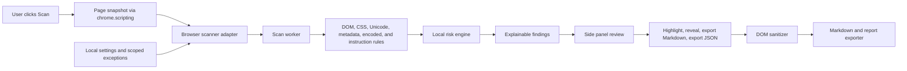
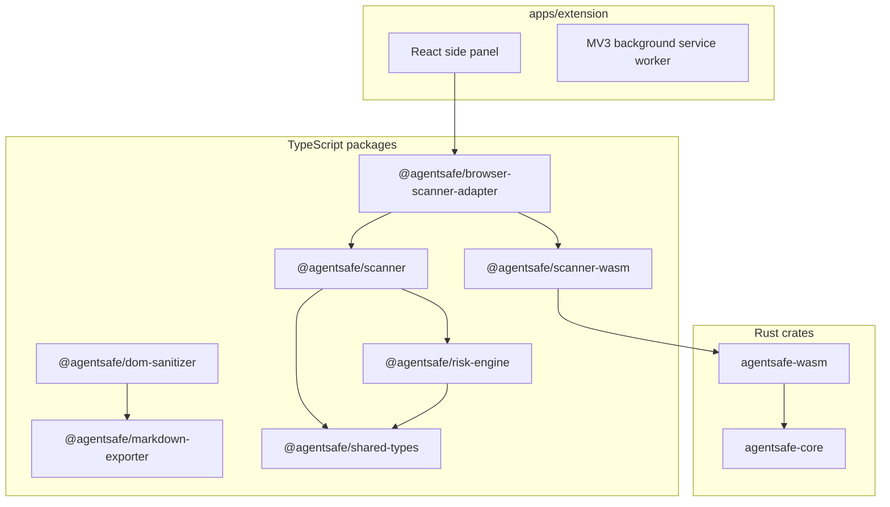

# AgentSafe - Prompt Injection Detector

AgentSafe is a local-only Manifest V3 Chrome extension for inspecting webpages before they enter AI-agent, browser-assistant, or web-to-LLM workflows. It scans the active page for hidden instructions, encoded payloads, Unicode obfuscation, suspicious metadata, comments, delimiter blocks, and tool-use or data-exfiltration language.

AgentSafe does not use a backend, authentication, telemetry, analytics, remote code, or external AI APIs. All scanning, scoring, sanitizing, and export generation happens on the user's machine. Detection is advisory: it helps surface risk, but it is not a guarantee of safety.

## Why AgentSafe Exists

Modern AI agents increasingly read webpages, summarize browser content, call tools, and copy page text into model context. A page can contain text that a human never sees but an automated extractor may still collect. AgentSafe makes that hidden AI-facing surface visible, explainable, and exportable.

| Problem | AgentSafe Response |
| --- | --- |
| Hidden prompt-injection text in comments, metadata, CSS-hidden nodes, or offscreen elements | Detects visibility, extraction likelihood, evidence, selectors, and confidence |
| Obfuscated text using Unicode controls, zero-width characters, or encoded payloads | Normalizes and flags suspicious patterns with rule-specific explanations |
| Large pages that can freeze a side panel or browser tab | Uses worker-based scanning, chunking, progress updates, cancellation, and partial-scan metadata |
| AI workflows that need safer copied content | Exports sanitized Markdown and JSON reports locally |
| Reviewers who need to understand why something is risky | Provides title, verdict, concern, impact, confidence reason, and recommended action per finding |

## Product Flow



## Architecture

AgentSafe is a TypeScript and Rust monorepo. The Chrome extension is built with WXT and React, while the core scanner can use Rust/WASM-backed detection for performance-sensitive checks. The production manifest has no static host permissions and no content scripts that run automatically on every page.



## Current MVP

| Area | Status | Notes |
| --- | --- | --- |
| Explicit user-triggered scanning | Complete | Scan runs only after user action |
| Worker-based scan execution | Complete | Supports quick, standard, and deep scan modes |
| Large-page handling | Complete | Bounded traversal, chunking, progress, cancellation, and partial results |
| Rule coverage | Complete | Hidden CSS, comments, metadata, Unicode, encoded content, delimiter, tool-use, and exfiltration signals |
| Explainable findings | Complete | Evidence, selector, severity, confidence, verdict, visibility, extraction likelihood, and recommended action |
| Local risk scoring | Complete | Uses multi-signal scoring for stronger high-risk classification |
| Page interaction | Complete | Highlight findings, navigate evidence, and temporarily reveal hidden content |
| Local export | Complete | Sanitized Markdown and JSON report export |
| Privacy posture | Complete | No backend, telemetry, or remote AI calls; nothing written to disk unless the user exports |
| Scoped exceptions | Complete | Rule-scoped local exceptions stored in `chrome.storage.local` |

## Security And Privacy Model

| Principle | Implementation |
| --- | --- |
| Local-first | Page content is scanned in the browser extension context |
| Minimal persistence | Settings live in `chrome.storage.local`; the latest per-tab scan result is cached in memory-backed `chrome.storage.session` and cleared when Chrome closes |
| Explicit action | The extension scans only after the user chooses to scan, highlight, or reveal |
| No remote code | The production build uses packaged extension assets |
| No default host access | The manifest avoids broad static host permissions |
| Advisory output | Findings explain risk and confidence without claiming perfect detection |

## Development

```bash
pnpm install
pnpm test
pnpm --filter @agentsafe/extension dev
pnpm --filter @agentsafe/extension build
pnpm verify:clean
```

Load the production build from:

```text
apps/extension/.output/chrome-mv3
```

To scan local fixture files, open AgentSafe's extension details in Chrome and enable **Allow access to file URLs**.

The production build must include:

| Asset | Purpose |
| --- | --- |
| `apps/extension/.output/chrome-mv3/assets/scan-worker-*.js` | Isolated worker bundle for scan execution |
| `apps/extension/.output/chrome-mv3/assets/agentsafe_wasm_bg-*.wasm` | Local WASM scanner asset |

## Repository Map

| Path | Purpose |
| --- | --- |
| `apps/extension` | WXT React side panel and Manifest V3 extension entrypoints |
| `packages/scanner` | DOM, text, CSS, metadata, Unicode, encoded-content, and instruction-pattern scanner |
| `packages/browser-scanner-adapter` | Browser extraction contracts, worker coordinator, chunking, cancellation, and exception filtering |
| `packages/scanner-wasm` | TypeScript wrapper around the Rust/WASM scanner package |
| `packages/risk-engine` | Scoring, severity mapping, and summary aggregation |
| `packages/dom-sanitizer` | Local DOM cleanup and suspicious-content neutralization |
| `packages/markdown-exporter` | Readability extraction plus Markdown and JSON report generation |
| `packages/shared-types` | Shared public data contracts |
| `crates/agentsafe-core` | Rust scanner primitives and rule evaluation |
| `crates/agentsafe-wasm` | WASM bindings for browser packaging |
| `fixtures` | Benign, malicious, scanner, WebMCP, and performance fixtures |
| `docs` | Architecture, threat model, privacy, Chrome Store, scan lifecycle, and audit documentation |

## Quality Gates

| Command | What It Verifies |
| --- | --- |
| `pnpm test` | JavaScript and TypeScript unit tests |
| `pnpm typecheck` | Package builds and extension type safety |
| `pnpm e2e` | Playwright smoke coverage for fixtures and side panel source |
| `pnpm --filter @agentsafe/extension build` | Production Chrome MV3 extension output |
| `pnpm verify:clean` | Frozen install, Rust format, clippy, Rust tests, TypeScript checks, JS tests, e2e, and production build |

## Future Roadmap

| Phase | Goal | Candidate Work |
| --- | --- | --- |
| 0.2 - Reviewer polish | Make findings easier to understand and triage | Rule documentation generated from source, richer evidence grouping, clearer false-positive guidance, and improved report summaries |
| 0.3 - Coverage expansion | Improve detection across real-world page types | More fixtures for CMS pages, docs sites, issue trackers, email-style pages, dashboards, and dynamic apps |
| 0.4 - Packed-extension validation | Test closer to Chrome Web Store behavior | Playwright coverage against a packed MV3 build, install/update smoke tests, and permission regression checks |
| 0.5 - Custom local rules | Let advanced users tune detection locally | Optional local-only rule editor, import/export for rule packs, and per-site rule overrides |
| 0.6 - Performance hardening | Keep scans fast on large and complex pages | Benchmarks for deeply nested DOMs, streaming export improvements, worker memory profiling, and WASM size tracking |
| 0.7 - Enterprise readiness | Support teams that review AI-facing web content | Signed release artifacts, policy templates, audit-friendly reports, and managed configuration guidance |

## Release Readiness Checklist

| Check | Expected Result |
| --- | --- |
| Manifest review | Permissions match documented use and Chrome Store justification |
| Local verification | `pnpm verify:clean` passes |
| Extension output | `.output/chrome-mv3` contains manifest, side panel, worker, and WASM assets |
| Fixture scan | Benign pages stay low risk and malicious fixtures produce expected findings |
| Privacy review | No telemetry, backend calls, analytics, or persisted page body content |
| Store copy | Listing, screenshots, privacy policy, and permission justification are current |

## Documentation

Start here for deeper detail:

| Document | Topic |
| --- | --- |
| `ARCHITECTURE.md` | High-level implementation sequence and package roles |
| `docs/WORKER_SCANNING_ARCHITECTURE.md` | Worker-based scan architecture |
| `docs/SCAN_LIFECYCLE.md` | Scan lifecycle and status model |
| `docs/threat-model/THREAT_MODEL.md` | Threat model |
| `docs/privacy/PRIVACY.md` | Privacy posture |
| `docs/chrome-store/CHROME_STORE_LISTING.md` | Chrome Store listing copy |
| `docs/chrome-store/PERMISSION_JUSTIFICATION.md` | Permission rationale |
